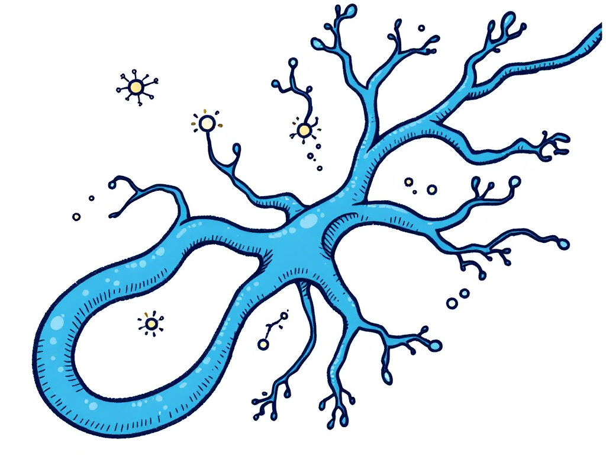

# Axonet 🧠

A minimal neural network implementation built from scratch in pure Python, featuring automatic differentiation and backpropagation. Designed for educational purposes, Axonet provides a clear understanding of neural networks' inner workings.



This project was inspired by Andrej Karpathy's [micrograd](https://github.com/karpathy/micrograd).

## Features
- Custom autograd engine 
- Multi-layer perceptron (MLP) implementation
- Backpropagation from scratch
- Pure Python with minimal dependencies
- No deep learning frameworks required

## Installation
```bash
# Clone the repository
git clone https://github.com/williampeoch/axonet.git

# Navigate to Axonet directory
cd axonet

## Quick Start
```python
from MLP import MLP

# Create a neural network
# 2 inputs, hidden layer of 4 neurons, 1 output
mlp = MLP(input_size=2, layers_size=[4, 1])

# Training data (XOR problem)
X = [[0, 0], [0, 1], [1, 0], [1, 1]]
y = [[0], [1], [1], [0]]

# Train
for epoch in range(1000):
    total_loss = 0
    for x_i, y_i in zip(X, y):
        loss = mlp.train_step(x_i, y_i)
        total_loss += loss
    
    if epoch % 100 == 0:
        print(f"Epoch {epoch}, Loss: {total_loss/len(X)}")

# Test
for x in X:
    pred = mlp(x)[0].data
    print(f"Input: {x}, Prediction: {pred:.3f}")
```

## Project Structure
```
axonet/
├── MLP.py          # Neural network classes (Neuron, Layer, MLP)
├── Value.py        # Autograd engine
└── example.py      # Usage examples
```

## Components

### Value.py
The core autograd engine. Implements automatic differentiation through operator overloading, allowing for automatic computation of gradients.

### MLP.py
Contains three main classes:
- `Neuron`: Basic computational unit
- `Layer`: Collection of neurons
- `MLP`: Full neural network architecture

### example.py 
Demonstrates the XOR problem implementation, a classic non-linearly separable problem.

## Contributing
Contributions are welcome! Feel free to:
- Report bugs
- Suggest new features
- Submit pull requests

## License
Released under the MIT License. Feel free to use this code for any purpose, including commercial applications.